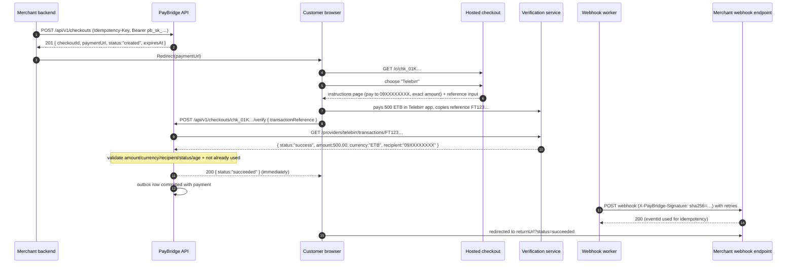

# PayBridge — Hosted Checkout & Payment Verification Platform

**Status:** Design (v1) · **Date:** 2026-09-11
**Scope:** Hosted checkout page + Checkout API + payment verification + merchant webhook system.
The merchant never handles receipts — the customer enters a **transaction reference**, and the
existing verification service decides whether the payment is real.

---

## 1. System boundary

```
┌────────────────────────────────────────────────┐   ┌──────────────────────────────┐
│                 PayBridge (this build)         │   │   Existing verification      │
│  ────────────────────────────────────────      │   │   service (already exists)   │
│  • Merchant API (create/get checkouts)         │   │                              │
│  • Hosted checkout pages                       │   │  • Talks to wallets          │
│  • Transaction reference collection            │◄─┼─►•  (Telebirr, CBE Birr, …)   │
│  • Verification orchestration + validation     │   │  • Finds the transaction     │
│  • Checkout/payment state                      │   │  • Returns authoritative     │
│  • Outbox + webhook dispatcher                 │   │    transaction facts         │
│  • Merchant & payment-method configuration     │   │                              │
└────────────────────────────────────────────────┘   └──────────────────────────────┘
```

PayBridge **never** talks to Telebirr itself and never duplicates verification logic.
It consumes the verification service behind one Rust trait (`verify::TransactionVerifier`)
with two adapters:

| Adapter | Purpose |
| --- | --- |
| `HttpVerifier` | Calls the real verification service (see `VERIFICATION_SERVICE_CONTRACT.md`) |
| `MockVerifier` | Local dev/tests: `FT…` refs succeed with the exact expected amount/recipient; `mismatch-…` returns a wrong amount; `missing-…` returns not-found; `failed-…` returns a failed transaction |

Everything downstream is identical regardless of adapter, so the real integration is a
config flip (`VERIFIER=http` + `VERIFY_SERVICE_URL`).

---

## 2. End-to-end flow



---

## 3. Tech stack & repo layout

| Decision | Choice | Rationale |
| --- | --- | --- |
| Language/framework | **Rust + Axum** | Consistent with the existing `payment-service`, single deployable, great async story |
| Database | **SQLite (dev) → Postgres (prod)** via **SQLx** | Zero-setup local dev; outbox worker + unique constraints work on both. Prod needs Postgres for `SKIP LOCKED` multi-worker claiming |
| Hosted checkout UI | **Askama server-rendered HTML + a little vanilla JS** | No SPA/CORS surface for customers; forms post to same origin |
| IDs | **ULID** with prefixes (`chk_`, `pay_`, `evt_`) | Sortable, unguessable, matches the spec examples |
| Money | **Integers (minor units)** internally; decimal ≤ 2dp on the API edge | Never floats for money |
| Background work | Tokio worker tasks polling the outbox (MVP); `NOTIFY`/`SKIP LOCKED` later | Simple, reliable, upgrade path clear |

```
paybridge/
├── docs/                      ← this design, verification contract, SCHEMA.sql
├── migrations/                ← SQLx migrations (from docs/SCHEMA.sql)
└── src/
    ├── main.rs                ← router, workers spawn, config
    ├── config.rs              ← env configuration
    ├── db.rs                  ← pool + migrations
    ├── ids.rs                 ← ULID helpers (chk_, pay_, evt_)
    ├── money.rs               ← decimal↔minor-unit parsing/validation
    ├── auth.rs                ← merchant API-key extraction (hashed keys)
    ├── domain/
    │   ├── checkout.rs        ← state machine + transitions
    │   └── verification.rs    ← validation rules (§8)
    ├── api/                   ← merchant-facing JSON API (Bearer auth)
    │   ├── mod.rs
    │   └── checkouts.rs       ← POST+GET /api/v1/checkouts…
    ├── public_api.rs          ← POST /api/v1/checkouts/{id}/verify (customer browser)
    ├── hosted/                ← /c/{id} pages (askama templates/, CSRF, rate limits)
    ├── verify/
    │   ├── mod.rs             ← TransactionVerifier trait + VerifiedTransaction
    │   ├── http.rs            ← HttpVerifier (existing service)
    │   └── mock.rs            ← MockVerifier (dev)
    ├── webhooks/
    │   ├── signing.rs         ← HMAC-SHA256, header building
    │   └── dispatcher.rs      ← outbox → deliveries → retries
    └── workers.rs             ← expiry sweeper + dispatcher loop
```

---

## 4. Domain model

```
Merchant 1─* MerchantApiKey
Merchant 1─* MerchantPaymentMethod        (Telebirr 09XXXXXXXX …, status active/disabled)
Merchant 1─* WebhookEndpoint              (url, secret)
Merchant 1─* Checkout 1─* CheckoutItem
Checkout 1─* Payment                      (one per method-selection/attempt)
Payment  1─0..1 Transaction               (inserted ONLY after successful verification)
Checkout  *─1 OutboxMessage 1─* WebhookDelivery
Checkout 1─* PaymentAttempt               (audit trail of every verify call)
Merchant 1─* IdempotencyKey               (Idempotency-Key replay protection)
```

Full DDL: **`docs/SCHEMA.sql`**. Key integrity rules:

- `transactions`: **`UNIQUE (provider, transaction_reference)`** — a successfully consumed
  transaction can pay exactly one checkout. (SQLite partial-index semantics are not needed:
  rows are only inserted on success and never deleted.)
- `checkouts`: `UNIQUE (merchant_id, idempotency_key)` via `idempotency_keys` table.
- Money columns: `amount_minor INTEGER` + `currency CHAR(3)`.

---

## 5. Merchant API (v1)

Auth: `Authorization: Bearer pb_sk_…` — key stored **hashed** (SHA-256), looked up by a
stored key prefix. V1 merchants are seeded admin-side (SQL/CLI); no self-serve yet.

### 5.1 `POST /api/v1/checkouts`

Request (all money as decimal numbers with ≤ 2 dp):

```json
{
  "reference": "ORDER-12345",
  "amount": 500.00,
  "currency": "ETB",
  "items": [
    { "name": "Premium Ticket", "quantity": 1, "unitPrice": 500.00 }
  ],
  "customer": { "name": "John Doe", "email": "john@example.com" },
  "returnUrl": "https://merchant.com/payment/result",
  "expiresInSeconds": 86400
}
```

Rules: `reference` required (merchant's own id); `currency` must be `ETB` in v1;
`amount` must equal Σ `quantity × unitPrice` when `items` is supplied (else `400 amount_items_mismatch`);
`expiresInSeconds` optional, default 24h, max 7d. `Idempotency-Key` header honored:
replays return the **same** `checkoutId` (201 both times).

Response `201` (money crosses the API as decimal strings + `amountMinor` integers —
never floats):

```json
{
  "checkoutId": "chk_01K5G2QX8T9YV2A3B4C5D6E7F8",
  "paymentUrl": "http://localhost:4000/c/chk_01K5G2QX8T9YV2A3B4C5D6E7F8",
  "status": "created",
  "amount": "500.00",
  "amountMinor": 50000,
  "currency": "ETB",
  "expiresAt": "2026-09-12T13:30:00Z"
}
```

Merchant integration is literally `return Redirect(paymentUrl);`.

### 5.2 `GET /api/v1/checkouts/{checkoutId}`

Full checkout + current `status` (`created|pending|succeeded|failed|expired`),
`paidAt`, selected `paymentMethod`, `transactionReference` (once paid), `attempts` count.

### 5.3 `POST /api/v1/checkouts/{checkoutId}/verify`  *(public — called by the customer's browser)*

No API key: `checkoutId` is an unguessable ULID and the endpoint is rate-limited.
Request `{ "transactionReference": "FT123456789" }`. Response is intentionally minimal —
no merchant data leaks:

| HTTP | Body | Meaning |
| --- | --- | --- |
| 200 | `{ "checkoutId", "status": "succeeded", "occurredAt" }` | Validated & consumed |
| 200 | `{ "checkoutId", "status": "failed", "reason": "amount_mismatch" }` | Verification ran, validation rejected. Checkout stays `pending` — customer may retry |
| 409 | `{ "error": "checkout_not_pending", "status": "succeeded" }` | Terminal state (already paid / expired) |
| 404 | checkout unknown | |
| 429 | `{ "error": "too_many_attempts" }` | Rate limit |

`reason` enum: `transaction_not_found`, `transaction_not_successful`, `transaction_too_old`,
`amount_mismatch`, `currency_mismatch`, `recipient_mismatch`, `transaction_already_used`,
`too_many_attempts`. Every attempt (success or failure) is appended to `payment_attempts`
for audit + rate limiting.

---

## 6. Checkout state machine

```
            ┌──────────┐  customer opens hosted page / picks method
  create ──►│ created  │──────────────────────────────┐
            └──────────┘                              ▼
                 │ TTL expires                    ┌─────────┐  verify OK   ┌───────────┐
                 ▼                                │ pending │─────────────►│ succeeded │ (terminal)
            ┌─────────┐                           └─────────┘              └───────────┘
            │ expired │                                │
            └─────────┘   (a failed verification does    └──► stays pending (customer may retry
                           NOT fail the checkout)            with a different reference)
```

- `succeeded` is terminal — further verify calls get `409 checkout_not_pending`.
- `failed` is reserved (e.g. reversal discovered later); not reachable in v1 flows.
- Expiry: worker marks `pending|created` checkouts past `expires_at` as `expired`
  every 60s. Verifying an expired checkout → `409`.
- State transitions live in one place (`domain/checkout.rs::transition`) and are the only
  code allowed to write `checkouts.status`.

---

## 7. Hosted checkout pages

| Route | Purpose |
| --- | --- |
| `GET /c/{checkoutId}` | Order summary (items, total, merchant name), method buttons for each **active** `MerchantPaymentMethod` |
| `POST /c/{checkoutId}/method` | Selects a method → instructions page; checkout → `pending` |
| `POST /c/{checkoutId}/verify` | Form version of §5.3; on success redirect to `returnUrl?checkoutId=…&reference=…&status=succeeded`, else re-render with the failure reason |

Telebirr instructions page copy (note: **never** the word "receipt"):

```
Pay with Telebirr                    Amount: 500 ETB
Send payment to: 09XXXXXXXX  [Copy]
1. Open Telebirr
2. Send exactly 500 ETB
3. Copy the transaction reference
4. Return here and paste it below

Transaction reference
[________________________]
[ Verify Payment ]
```

Hardening: CSRF token (random cookie + hidden field, SameSite=Lax), per-checkout attempt
cap (10) with a 5s cooldown between attempts, `X-Frame-Options: DENY`, no caching headers.
The page fetches nothing from merchant origins; branding comes from merchant config.

---

## 8. Verification orchestration (the core rules)

`POST …/verify` runs this exact sequence — **never** "verify → success → mark paid":

```
1. Load checkout                     → 404 / 409 if not found / not pending
2. Rate limits                       → 429 (attempts ≥ 10, or < 5s since last attempt)
3. verifier.find(provider, reference)→ transaction_not_found / transaction_not_successful
4. tx.status == "success" ?          → transaction_not_successful
5. tx.amount_minor == checkout.amount_minor           → amount_mismatch
6. tx.currency == checkout.currency                   → currency_mismatch
7. tx.recipient == selected_method.account_identifier → recipient_mismatch
8. tx.occurred_at >= checkout.created_at              → transaction_too_old
9. INSERT transaction (UNIQUE provider+reference)     → transaction_already_used (409)
10. In ONE db transaction:
      checkout → succeeded, payment → succeeded,
      insert transaction + outbox event, commit
11. Return 200 immediately (webhook delivery is asynchronous)
```

Steps 5–8 are what stops the classic attack: a *real* 100 ETB Telebirr reference cannot pay
a 500 ETB checkout, and step 9 stops one transaction paying two checkouts.

---

## 9. Merchant webhooks

### 9.1 Event envelope

```json
{
  "eventId": "evt_01K5G2T4W6X8Y0Z2A4B6C8D0E2",
  "event": "checkout.payment_succeeded",
  "checkoutId": "chk_01K5G2QX8T9YV2A3B4C5D6E7F8",
  "reference": "ORDER-12345",
  "amount": "500.00",
  "amountMinor": 50000,
  "currency": "ETB",
  "paymentMethod": "telebirr",
  "transactionReference": "FT123456789",
  "status": "succeeded",
  "occurredAt": "2026-09-11T18:30:00Z"
}
```

(`amount` is a decimal **string** to avoid float corruption; `amountMinor` is exact.)

### 9.2 Signature & headers

```
X-PayBridge-Signature: sha256=hex(HMAC_SHA256(endpoint_secret, raw_body))
X-PayBridge-Event-Id:  evt_01K5G2T4W6X8Y0Z2A4B6C8D0E2
X-PayBridge-Timestamp: 1726074600
```

Merchant-side verification: recompute HMAC over the **raw** body bytes, constant-time
compare; reject if `X-PayBridge-Timestamp` deviates more than 5 minutes; dedupe on
`eventId` (`UNIQUE(eventId)` on their side) so retries are harmless.

### 9.3 Reliability (outbox pattern)

- The `checkout.payment_succeeded` outbox row is committed **in the same DB transaction**
  that marks the checkout succeeded — an event can never be lost or invented.
- Customer-visible verify response never waits on the merchant HTTP call.
- Dispatcher worker: claim due outbox rows → render payload → POST to endpoint → record
  `WebhookDelivery` attempt → `2xx` ⇒ `delivered`, else schedule retry.

| Attempt | Delay after previous |
| --- | --- |
| 1 | immediate |
| 2 | 30 s |
| 3 | 2 min |
| 4 | 10 min |
| 5 | 45 min |
| 6 | 2 h |
| 7 | 6 h |
| 8 | 24 h → then `dead` (visible in admin/ops query; manual replay endpoint in v2) |

- v1: one `WebhookEndpoint` per merchant. Delivery log (`webhook_deliveries`) keeps every
  attempt's status code, error and duration for support/debugging.

---

## 10. Background workers

| Worker | Interval | Job |
| --- | --- | --- |
| Expiry sweeper | 60 s | `pending|created` past `expires_at` → `expired` |
| Webhook dispatcher | 5–15 s | Deliver due outbox events with retry schedule above |

MVP: both are tokio tasks with `sqlx` polling. Postgres upgrade: `FOR UPDATE SKIP LOCKED`
claiming so N workers can scale horizontally. No external queue (Redis/RabbitMQ) needed —
the outbox table *is* the queue.

---

## 11. Security checklist

- [ ] Merchant keys hashed at rest; lookup by prefix; `pb_sk_test_` vs `pb_sk_live_` prefixes
- [ ] Webhook secrets ≥ 32 random bytes, generated per endpoint, shown once
- [ ] Public verify endpoint: per-checkout attempt cap + cooldown + per-IP limiter later
- [ ] Checkout IDs are ULIDs (unguessable) — the hosted page grants no merchant data access
- [ ] CSRF on hosted forms; security headers; no caching of checkout pages
- [ ] All money comparisons in minor units; currency validated explicitly
- [ ] TLS terminated at the edge (`pay.yourdomain.com`); HSTS
- [ ] Audit: `payment_attempts` + `webhook_deliveries` retained; structured logs with `checkout_id`
- [ ] Secrets only from env; `.env` git-ignored

---

## 12. Configuration

```env
PAYBRIDGE_BIND=0.0.0.0:4000
DATABASE_URL=sqlite://paybridge.db?mode=rwc
PAYBRIDGE_BASE_URL=http://localhost:4000     # used to build paymentUrl

VERIFIER=mock                                 # mock | http
VERIFY_SERVICE_URL=http://localhost:8080      # existing verification service
VERIFY_SERVICE_API_KEY=                       # if it requires auth

CHECKOUT_TTL_DEFAULT=24h
CHECKOUT_TTL_MAX=7d
VERIFY_MAX_ATTEMPTS_PER_CHECKOUT=10
VERIFY_ATTEMPT_COOLDOWN=5s
WEBHOOK_RETRY_SCHEDULE=0s,30s,2m,10m,45m,2h,6h,24h
WORKER_POLL_INTERVAL=5s
```

Seed migration (dev) creates merchant **Acme Tickets** with key
`pb_sk_test_acme_local_only`, an active Telebirr method `+251900000000`, and webhook
endpoint `http://localhost:4001/webhooks` (a tiny echo receiver to watch deliveries).

---

## 13. Build order → milestones

| # | Milestone (spec step) | Acceptance criteria |
| --- | --- | --- |
| M1 | Schema + config + IDs/money helpers (steps 1, 4) | `sqlx migrate run` clean; seeded merchant/method/endpoint |
| M2 | Checkout API: POST + GET, auth, idempotency (step 2) | curl create → `paymentUrl`; replay with same `Idempotency-Key` returns same `checkoutId`; bad key → 401 |
| M3 | Hosted pages: summary, method select, Telebirr instructions, reference input (steps 3, 5, 6) | Browser flow works; expired/unknown checkouts render correctly |
| M4 | Verifier trait + MockVerifier wired into public verify (steps 7, 8) | Verify with mock refs returns succeeded / each failure reason |
| M5 | Full validation + state transition + reuse prevention (steps 8, 9, 11) | Wrong-amount ref rejected; same ref on 2nd checkout → `transaction_already_used`; succeeded is terminal |
| M6 | Outbox + webhook dispatcher + signing (steps 10, 11) | `checkout.payment_succeeded` delivered to echo receiver with valid HMAC |
| M7 | Retries + dead-letter + expiry sweeper (step 12) | Failing endpoint sees exponential retries; stale checkouts auto-expire |
| M8 | Hardening + tests (step 13) | Rate limits active; CSRF; key hashing; integration test covering the full flow |

Chrome extension stays out of scope — it would only automate the last step of M3.

---

## 14. Decisions taken (defaults — override freely)

1. **New standalone service** (`paybridge`), separate from the existing Chapa
   `payment-service` — different product, no shared state.
2. **Rust/Axum/SQLx**, SQLite dev → Postgres prod.
3. **ULIDs, minor-unit integers, decimal-string money in webhooks.**
4. **Webhook v1**: HMAC over raw body exactly as spec'd (`sha256=…`), timestamp header +
   tolerance advice; one endpoint per merchant.
5. **Failed verification ≠ failed checkout** — customer can retry with another reference.
6. **Full-amount payments only** — no partial payments, no refunds in v1.

## 15. Open questions (need your input before/during M4)

1. **Verification service**: does the assumed contract in
   `VERIFICATION_SERVICE_CONTRACT.md` match the real one? Auth? Where is it deployed?
2. **Telebirr recipient matching**: does the verification service return the *exact*
   receiving wallet number (not masked)? Validation depends on it.
3. **Telebirr reference format**: any checksum/format we can pre-validate client-side?
4. **Database**: is Postgres available for prod (Docker?), or stay on SQLite longer?
5. **Merchant onboarding**: admin SQL is fine for v1 — when do we need a real admin UI?
6. **Domain**: what host will `paymentUrl` use in staging/prod?
